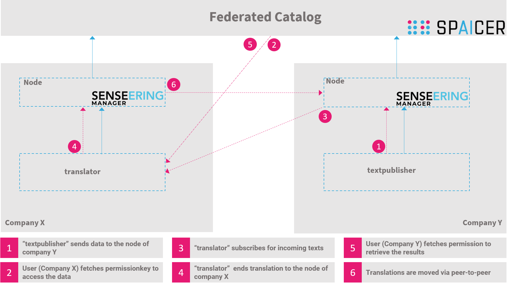

<p align="center" >
  
</p>

<p align="center">
   Scalable adaptive production systems through AI-based resilience optimization. <br>
    Powered by <a href="https://www.mydataeconomy.com/#/search">MyDataEconomy</a>
</p>
<p align="center">
  <a href="https://discord.gg/qDF38JDR3D" style="text-decoration:none;"></a>
</p>

## Motivation

in a globalized and interconnected business world, production interruptions including supply chain disruption have been the leading business risk for many years.

The ability of a company to permanently adapt to internal and external changes and disruptions is the "quest for resilience". Reinforced by a significant increase in complexity in production due to Industry 4.0, resilience management thus becomes an indispensable success factor for manufacturing companies.

The SPAICER project is developing a data-driven ecosystem based on lifelong, collaborative and low-threshold Smarter Resilience services by leveraging leading AI technologies and Industrie 4.0 standards with the goal of anticipating disruptions (anticipation) and optimally adapting production plans to active disruptions (reaction) at any time.

## Architecture
It is a decentralized architecture in which participating parties exchange data in a sovereign way. The federated catalog serves as a search engine for data sources and data that was created, based on services.
<p align="end" >
  
</p>

<p align="center" >
  
</p>


## Scenario

We have a data producer who regularly publishes texts **1**. This can be done every minute or every second. This data producer passes on the data to participating partners within SPAICER, which may be used according to SPAICER guidelines. 
<p align="center" >
  
</p>
<p align="center" >
  
</p>


A service provider would like to use this data to build up its own database to improve its translation algorithms, and also give the data producer the opportunity to use its service. However, his USP (the translation algorithm) should not to be published. The service provider obtains the authorization to the different texts of the data producer ( Company Y)**2** via the catalog. This is only possible because both parties are within the same project (SPAICER). 


<p align="center" >
  
</p>


<p align="center" >
  
</p>


<p align="center" >
  
</p>


The actual transfer of the data then takes place with a peer-to-peer connection **3**.
This can be done with the help of batch downloads. In our case, we decide to use an event-based data stream (websockets).  

<p align="center" >
  
</p>


The translated texts are stored on the service provider's node **4** and Company Y is released. 
<p align="center" >
  
</p>


<p align="center" >
  
</p>


<p align="center" >
  
</p>

Company Y can now use the catalog to find the data **5** and either transfer the data to its own network **6** or use it freely via open APIs (event-based or batch-based). 


<p align="center" >
  
</p>


<p align="center" >
  
</p>


<p align="center" >
  
</p>


## Install
### Prerequisits
You need to install <a href="https://nodejs.org/en/">node.js</a>

### Create azure translate service
You can simply use  <a href="https://azure.microsoft.com/de-de/services/cognitive-services/translator/"> the instructions</a> and create a free service. You will then need the url and permissionkeys.

### Installation

Clone this repository by
```
git clone hgit@github.com:Senseering/spaicer-translation-srs.git
cd spaicer-translation-srs
```
install node modules by

```
cd textpublisher
npm install
cd ..
cd service
npm install
```


### Configuration 
To configure the two workers you need to register a new datasource at the providing Manager. This datasource publishes raw texts that need to be translated.
....
